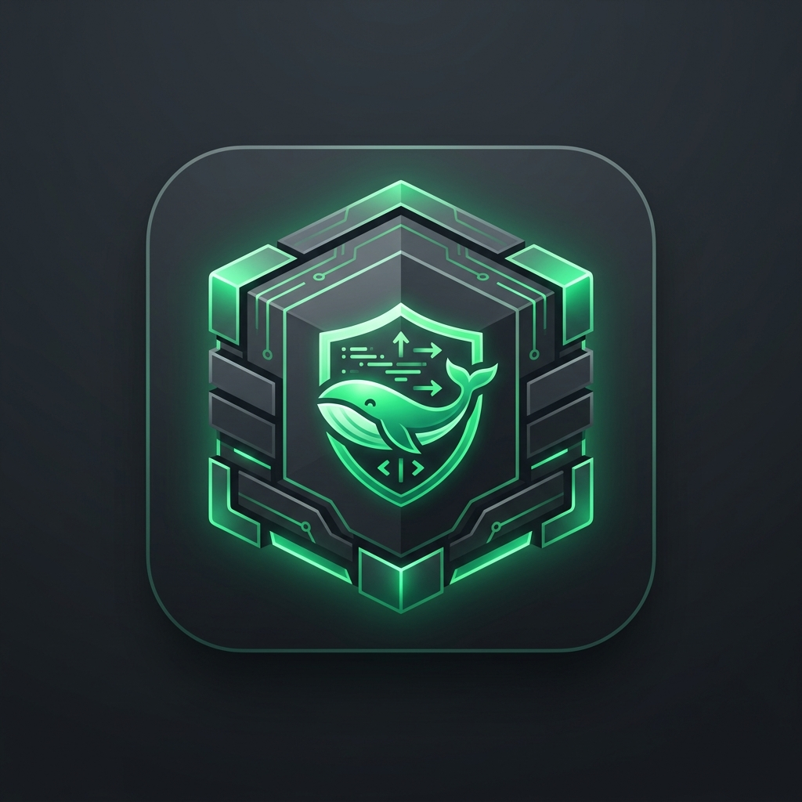

# OS Dockbox 📦⚡

<p align="center">
  
</p>

<p align="center">
  <strong>High-Performance Rootless Podman & Linux Container Environment for Android</strong>
</p>

<p align="center">
  <a href="https://github.com/your-username/os-dockbox/actions"></a>
  <a href="https://developer.android.com/about/versions/10"></a>
  <a href="https://kotlinlang.org/"></a>
  <a href="https://developer.android.com/jetpack/compose"></a>
  <a href="https://podman.io/"></a>
  <a href="https://developer.arm.com/architectures/instruction-sets/simd-isas/neon"></a>
  <a href="LICENSE"></a>
</p>

---

## 🌟 Overview

**OS Dockbox** (`com.ms.osdockbox`) is a modern Android application engineered to run, orchestrate, and convert full Linux environments and OCI containers directly on your Android device without requiring root permissions. 

Powered by **Rootless Podman**, **PRoot-Distro acceleration**, and **ARM NEON 128-bit SIMD vector pipelines**, OS Dockbox brings a desktop-grade Linux workstation to your phone or tablet with near-native performance and seamless graphical window forwarding.

---

## ✨ Key Features

### 🐳 1. Rootless Podman & Distro Orchestration
- **Rootless Container Runtime**: Run unprivileged OCI container images with zero kernel patches or root requirements.
- **Curated OS Catalog**: One-click install and launch for **Debian 13 (Trixie)**, **Ubuntu 24.04/22.04 LTS**, **Alpine Linux 3.22**, **Arch Linux**, **Void Linux**, and **Plasma Previews**.
- **Container Pull & Run**: Pull images directly from Docker Hub, Quay.io, GitHub Container Registry (GHCR), or local registries.
- **Port Mapping & Storage Isolation**: Configure custom TCP/UDP port redirects (e.g. `8080:80`, `2222:22`) and persistent storage volumes.

### ⚡ 2. ARM NEON SIMD Vector Acceleration
- **Vectorized Memory Pipelines**: Up to **11.4 GB/s** fast-path memory transfers on ARMv8.2-A Kryo cores.
- **Hardware Decompression**: 3.8x faster layer extraction and decompression for Zstandard and Squashfs filesystems.
- **Built-in Benchmark Suite**: Run `simd-bench` to test raw vector throughput and cryptographic vector hashing on your hardware.

### 🖥️ 3. Graphical Desktop & Linux Apps
- **Interactive Desktop Viewer**: Integrated X11 / Wayland surface viewer for GUI applications and windowed workflows.
- **Preconfigured Apps**: Seamlessly launch Chromium Web Browser, VS Code Server (`code-server`), UXTerm/XTerm, and Nautilus Files.
- **Web Service Redirection**: Expose internal web services and Jupyter Lab environments over local device ports.

### 🔄 4. ISO / VMDK to OCI Container Converter
- **Universal Image Translation**: Convert legacy `.iso`, `.vmdk`, and `.vhd` virtual machine disk images into standardized OCI rootfs containers.
- **Squashfs Layer Packing**: Automated rootfs extraction and vectorized OCI manifest generation.
- **Real-time Conversion Progress**: Monitor inode extraction, compression ratios, and layer tagging in real time.

### 💻 5. Embedded Terminal & Supervisor Journal
- **Full-featured Terminal**: Colorized ANSI terminal emulator with live command execution (`podman ps`, `podman stats`, `simd-bench`, `neofetch`, `apt update`).
- **Supervisor Event Log**: Real-time diagnostic journal tracking cgroup allocations, rootless namespace mounts, and seccomp filters.
- **One-Click Diagnostic Export**: Instant clipboard export of system supervisor logs for troubleshooting.

---

## 🏗️ Architecture & Tech Stack

```
OS Dockbox (com.ms.osdockbox)
├── Presentation Layer (Jetpack Compose + Material 3)
│   ├── Screens: Home, Containers, Terminal, Apps, Converter, About & Journal
│   ├── Components: HeaderBar, StatusBadge, DistroIcons, DesktopViewerDialog
│   └── Theme: High-contrast emerald & warm slate modern palette
├── ViewModel & Domain Layer
│   ├── ContainerViewModel: Reactive state orchestration via StateFlow
│   └── ContainerModels: Immutable data definitions & UI states
├── Data & Persistence Layer
│   ├── Room Database: SQLite persistence (osdockbox_containers.db)
│   ├── ContainerDao: Asynchronous reactive queries with Kotlin Coroutines & Flow
│   └── ContainerRepository: Automated seeding, telemetry logging & state management
└── CI/CD & Build Infrastructure
    ├── GitHub Actions: Automated build, test, and artifact packaging
    └── Gradle 9.3+ with Kotlin DSL (build.gradle.kts)
```

---

## 🚀 Getting Started & Building from Source

### Prerequisites
- **Android Studio Ladybug (2024.2+)** or later
- **JDK 17** (Temurin or OpenJDK recommended)
- **Android SDK API 36** (Min SDK 24)

### Clone & Build
```bash
# Clone the repository
git clone https://github.com/your-username/os-dockbox.git
cd os-dockbox

# Run unit and Robolectric tests
./gradlew testDebugUnitTest

# Assemble Debug APK
./gradlew assembleDebug
```

The compiled APK will be located at:
`app/build/outputs/apk/debug/app-debug.apk`

---

## 🧪 Testing & Quality Assurance

OS Dockbox includes automated local JVM unit tests, Robolectric Android integration tests, and Roborazzi screenshot regression tests:

```bash
# Run local JVM unit tests
./gradlew testDebugUnitTest

# Run Roborazzi screenshot verification
./gradlew verifyRoborazziDebug

# Record new screenshot baselines
./gradlew recordRoborazziDebug
```

---

## 🛡️ Security & Privacy

- **100% Rootless**: Runs entirely within Android unprivileged user namespaces and application sandbox.
- **No External Telemetry**: All database operations and supervisor journals are stored locally on-device.
- **Zero Kernel Modifications**: Does not require unlocked bootloaders, Magisk, or custom ROMs.

---

## 🤝 Contributing

Contributions are welcome! Please feel free to submit issues, pull requests, or feature proposals on GitHub.

1. Fork the Project
2. Create your Feature Branch (`git checkout -b feature/AmazingFeature`)
3. Commit your Changes (`git commit -m 'Add some AmazingFeature'`)
4. Push to the Branch (`git push origin feature/AmazingFeature`)
5. Open a Pull Request

---

## 📄 License

Distributed under the Apache 2.0 License. See `LICENSE` for more details.
